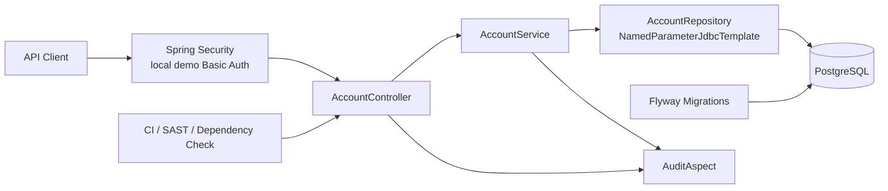

# DevSecOps Banking API Template

This repository is a sanitized Java 17 / Spring Boot template for a secure banking-style API. It is designed for portfolio review and architecture discussion, not for production banking operations. The implementation demonstrates clean layering, JDBC-based persistence, Flyway migrations, local-only Basic Auth, audit logging, automated tests, containerization, and DevSecOps workflows.

## Purpose

The project shows how a financial-sector API can be structured with practical security and release controls from the beginning. It intentionally avoids complex product features such as money movement, transfers, card operations, or regulatory claims. The goal is to demonstrate secure engineering discipline around a simple account resource.

## Business Context

Financial institutions need APIs that are predictable, auditable, testable, and safe to evolve. Even a basic account service should validate inputs, avoid unsafe SQL, protect endpoints, control schema changes, and produce useful audit events without exposing sensitive information.

## Architecture



## API Overview

- `GET /api/accounts/{id}`
- `GET /api/customers/{customerId}/accounts`
- `POST /api/accounts`

The template does not include transfer endpoints. Money movement requires stronger controls, idempotency, ledger design, reconciliation, fraud controls, and additional authorization.

## Security Controls

- Local-only Basic Auth for template execution.
- Production guidance to replace demo auth with corporate OAuth2/OIDC.
- Bean Validation on inbound requests.
- Named SQL parameters through `NamedParameterJdbcTemplate`.
- No `SELECT *` in repository queries.
- Flyway-controlled schema migration.
- Audit logging through AOP.
- Account number masking in API responses.
- No stack trace exposure through controller exception handlers.
- Dependency and static security workflows.

## DevSecOps Pipeline

The GitHub Actions configuration includes:

- Maven test execution.
- JaCoCo coverage report generation.
- Docker image build.
- SAST placeholder workflow that runs without external credentials.
- OWASP Dependency Check workflow.

## Audit and Compliance Approach

The audit aspect logs operation name, class/method, timestamp, and outcome. It does not log request bodies, full account numbers, Basic Auth headers, or credential values. The repository does not claim compliance certification; it is aligned with common financial-sector control expectations.

## Technology Stack

- Java 17
- Spring Boot 3
- Spring Web
- Spring Security
- Spring Validation
- Spring JDBC
- Spring AOP
- Flyway
- PostgreSQL
- Maven
- JaCoCo
- Docker
- GitHub Actions

## Run Locally

Start PostgreSQL:

```bash
docker compose up postgres
```

Run the app:

```bash
mvn spring-boot:run
```

The local demo user is configured through environment variables. The defaults are intentionally local-only and must not be used in production.

## Run Tests

```bash
mvn test
```

## Docker Usage

```bash
docker compose up --build
```

The application listens on port `8080`. PostgreSQL is exposed on local port `55433` to reduce collision with a local database installation.

## How to Extend

- Add new modules through Controller -> Service -> Repository boundaries.
- Replace local Basic Auth with OAuth2/OIDC.
- Add OpenAPI documentation.
- Add Testcontainers for repository integration tests.
- Add structured observability.
- Add rate limiting and request correlation IDs.
- Add account transaction APIs only with ledger, idempotency, reconciliation, and strong authorization controls.

## Limitations

- This is not a production banking system.
- It contains no real customer data.
- It uses local-only demo authentication.
- It does not implement transfers or ledger operations.
- It does not assert certified regulatory compliance.

## Privacy Disclaimer

This repository contains no real customer data, no private institutional data, no production hostnames, no infrastructure routes, and no proprietary implementation from any private system.

Versión en español disponible bajo solicitud.

