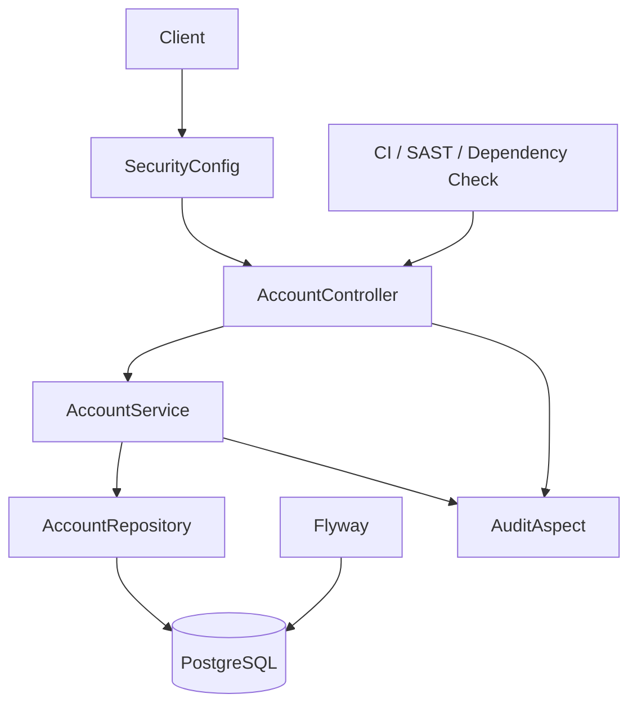

# Architecture

This template demonstrates a layered banking-style API with explicit security, audit, and database migration boundaries.

## Controller

The controller exposes a small account API and maps domain objects to response DTOs. It uses Bean Validation and handles service exceptions without exposing stack traces.

## Service

The service owns business validation. It prevents blank identifiers, negative initial balances, unsupported currencies, and duplicated account numbers.

## Repository

The repository uses `NamedParameterJdbcTemplate`, explicit column lists, and named SQL parameters. It avoids `SELECT *` and avoids string-concatenated user parameters.

## Flyway and PostgreSQL

Flyway owns schema evolution. The first migration creates the `accounts` table, constraints, and indexes.

## Security

The template uses local-only Basic Auth so the API is protected during review. Production systems should replace this with a corporate identity provider and OAuth2/OIDC.

## AuditAspect

The audit aspect logs operation name, timestamp, and outcome for controller and service methods. It avoids request bodies and credential values.

## CI/CD

The workflows run tests, generate coverage through JaCoCo, build Docker, and provide security scanning entry points.

